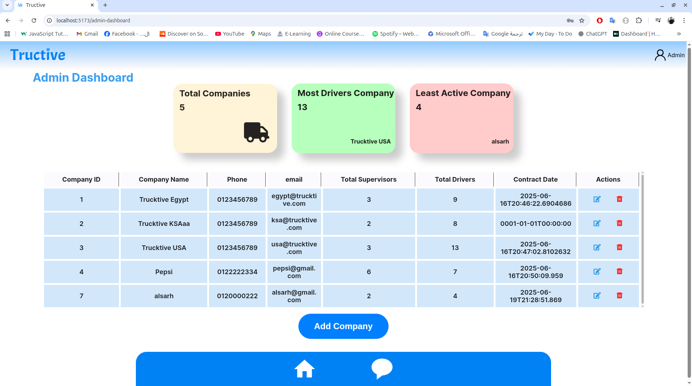
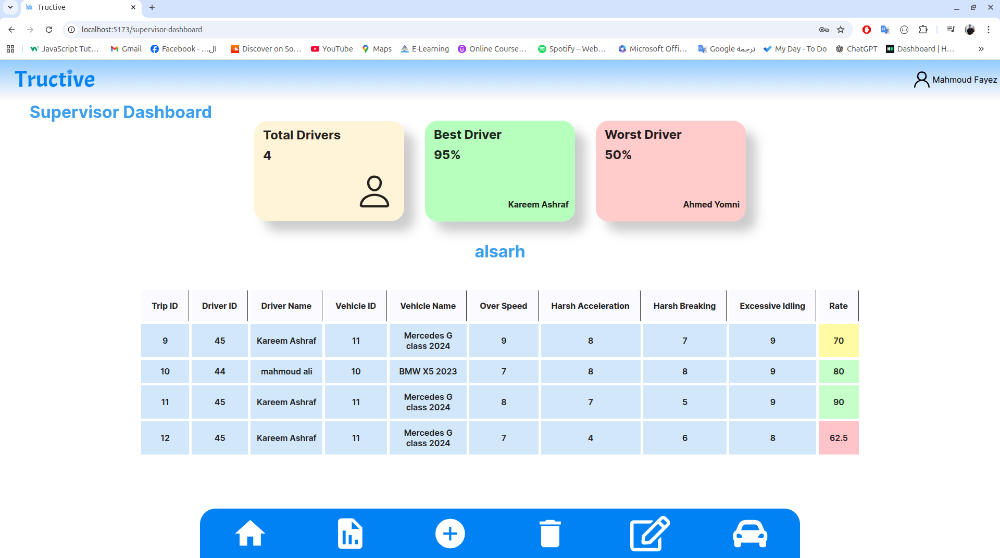

# Trucktive – Fleet Management Dashboard

A modern, responsive fleet management system dashboard built with React and TypeScript. This application provides comprehensive tools for managing vehicle fleets, drivers, and operational data with an intuitive interface.

## Features

- **Fleet Monitoring Dashboard**: Real-time overview of fleet status and performance metrics
- **Driver Management**: Complete driver profiles, ratings, and performance tracking
- **Vehicle Management**: Track vehicle conditions, maintenance, and availability
- **Data Visualization**: Interactive charts and analytics for operational insights
- **Multi-Role Support**: Admin and Supervisor roles with tailored interfaces
- **Responsive Design**: Optimized for desktop and laptop screens

## Tech Stack

- **Frontend**: React 19 + TypeScript
- **Routing**: React Router v6
- **HTTP Client**: Axios
- **UI Components**: Custom components with FontAwesome icons
- **Build Tool**: Vite
- **Styling**: CSS with modular organization
- **Form Handling**: Formik + Yup validation
- **Notifications**: React Toastify

## Installation

1. **Clone the repository**
   ```bash
   git clone <repository-url>
   cd tructive
   ```

2. **Install dependencies**
   ```bash
   npm install
   ```

3. **Set up environment variables**
   ```bash
   cp .env.example .env
   ```
   Edit the `.env` file with your API configuration.

4. **Start the development server**
   ```bash
   npm run dev
   ```

5. **Build for production**
   ```bash
   npm run build
   ```

## API Configuration

This project depends on external APIs for data management. The main API endpoint should be configured in your environment variables:

```
VITE_API_BASE_URL=https://your-api-endpoint.com/api
```

### Required API Endpoints

The application expects the following API structure:
- `/Auth/login` - Authentication
- `/Supervisors/{id}` - Supervisor data
- `/Drivers` - Driver management
- `/Vehicles` - Vehicle management
- `/Companies` - Company management

## Project Structure

```
src/
├── components/          # Reusable UI components
│   ├── admin-dashboard/ # Admin-specific components
│   ├── base-components/ # Shared base components
│   └── ...
├── services/           # API service layer
├── hooks/              # Custom React hooks
├── utils/              # Utility functions and constants
├── styles/             # Global styles and CSS
└── assets/             # Static assets
```

## Screenshots

### Admin Dashboard


### Supervisor Dashboard  


## Live Demo

[🚀 View Live Demo](https://tructive.vercel.app)

## Available Scripts

- `npm run dev` - Start development server
- `npm run build` - Build for production
- `npm run lint` - Run ESLint
- `npm run preview` - Preview production build


## Author

Graduation Project - Fleet Management System

---

**Note**: This is the frontend application only. The backend API is a separate service that needs to be deployed and configured independently.


